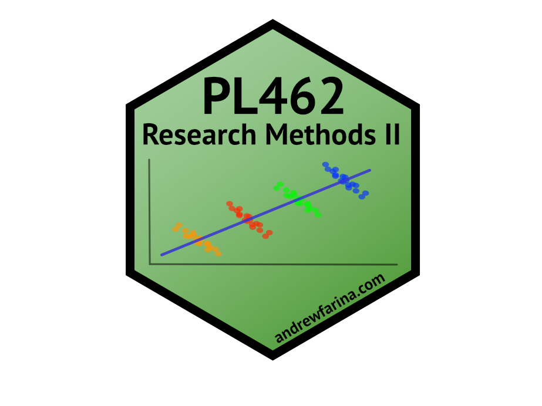

<!-- README.md is generated from README.Rmd. Please edit that file -->

```{r, include = FALSE}
knitr::opts_chunk$set(
  collapse = TRUE,
  comment = "#>",
  fig.path = "man/figures/README-",
  out.width = "100%"
)
```

# pl462 

<!-- badges: start -->
```{r echo= FALSE, message = FALSE, warning = FALSE}
usethis::use_lifecycle_badge("Experimental")
```
[](https://www.tidyverse.org/lifecycle/#experimental)
[](https://lifecycle.r-lib.org/articles/stages.html#experimental)
<!-- badges: end -->

The goal of pl462 is to create a data package to simplify student and teacher workflows for PL462. 

## Installation

You can install the released version of pl462 from [GitHub](https://github.com/A-Farina/pl462) with:

``` r
library(devtools)
devtools::install_github("A-Farina/pl462")
```

# Datasets:

## stalker dataset

```{r data, include = FALSE}
load(here::here("data", "stalker.rda"))
```

This dataset contains `r nrow(stalker)` observations and `r ncol(stalker)` variables (`r names(stalker)`).

**Categorical Variables**

  *   Therapy: Therapy Type (Cruel to be Kind Therapy, Psychodyshamic Therapy, None)
  *   AmtTher: Amount of Therapy (6 Weeks, 12 Weeks)

**Continuous Variables**

  *   Stalker: Time Spent Stalking (Hours per Week)

## fugazi dataset

```{r include = FALSE}
load(here::here("data", "fugazi.rda"))
```

This dataset contains `r nrow(fugazi)` observations and `r ncol(fugazi)` variables (`r names(fugazi)`).

**Categorical Variables**

  *   music: Type of Music (Fugazi, Abba, Mantilow)
  *   age: Age of Listener (0-40 Years, 40+ Years)

**Continuous Variables**

  *   liking: Liking Rating
  
## happyparent dataset

```{r include = FALSE}
load(here::here("data", "happyparent.rda"))
```

This dataset contains `r nrow(happyparent)` observations and `r ncol(happyparent)` variables (`r names(happyparent)`).

**Categorical Variables**

  *   sex: Sex of Parent (male, female)
  *   educ: Education of Parent (Ranging from 8th Grade to PhD)

**Continuous Variables**

  *   health: Self-reported Physical Health
  *   str_slf1: Amount of Stress Related to Self
  *   negmood1: Negative Mood Rating of Parent
  *   children: Total Number of Children
  *   str_chd: Amount of Stress Related to Children
  
## supermodel dataset

```{r include = FALSE}
load(here::here("data", "supermodel.rda"))
```

This dataset contains `r nrow(supermodel)` observations and `r ncol(supermodel)` variables (`r names(supermodel)`).

**Continuous Variables**

  *   salary: Salary per Day in British Pounds (\u00A3)
  *   age: Age in Years of Supermodel
  *   years: Number of Years as a Model
  *   beauty: Attractiveness (%)

## cholesterol dataset

```{r include = FALSE}
load(here::here("data", "cholesterol.rda"))
```

This dataset contains `r nrow(cholesterol)` observations and `r ncol(cholesterol)` variables (`r names(cholesterol)`). These data were contributed by Ellen Marshall, University of Sheffield as part of the [Statstutor community project.](www.statstutor.ac.uk).

**Categorical Variables**

  *   margarine: Type of Margarine Consumed (A, B)

**Continuous Variables**

  *   id: Participant ID
  *   before: Cholesterol before the intervention (mmol/L)
  *   after4weeks: Cholesterol after four weeks (mmol/L)
  *   after8weeks: Cholesterol after eight weeks (mmol/L)

## diet dataset

```{r include = FALSE}
load(here::here("data", "diet.rda"))
```

This dataset contains `r nrow(diet)` observations and `r ncol(diet)` variables (`r names(diet)`). These data were contributed by Ellen Marshall, University of Sheffield as part of the [Statstutor community project.](www.statstutor.ac.uk).

**Categorical Variables**

  *   sex: Biological Sex of Participant (Male, Female)
  *   diet_type: Type of Diet Consumed (1, 2, 3)

**Continuous Variables**

  *   person: Participant ID
  *   age: Age of Participant (Years)
  *   height: Height of Participant (cm)
  *   preweight: Weight of Participant before intervention (kg)
  *   weight10weeks: Weight of Participant after 10 weeks (kg)
  *   weight_loss: Weight change of Participant (kg)
  
## grit dataset

```{r grit, include = FALSE}
load(here::here("data", "grit.rda"))
```

This dataset contains `r nrow(grit)` observations and `r ncol(grit)` variables (`r names(grit)`).

**Categorical Variables**

  *   sex: Biological Sex (Female, Male)
  *   class: Timepoint of Measurement (Entry (Matriculation), Freshmen Spring, Yearling Spring)

**Continuous Variables**

  *   grit: Measure of Grit (Scale Score based on a 5-point Likert Scale)
