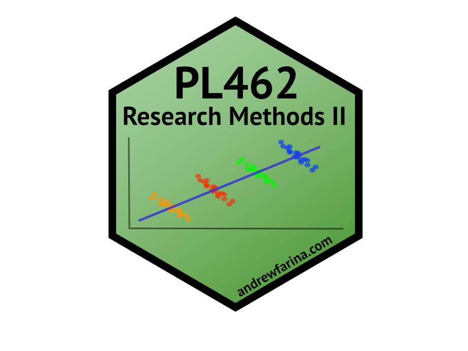

<!-- README.md is generated from README.Rmd. Please edit that file -->

# pl462 

<!-- badges: start -->

[](https://www.tidyverse.org/lifecycle/#experimental)
[](https://lifecycle.r-lib.org/articles/stages.html#experimental)
<!-- badges: end -->

The goal of pl462 is to create a data package to simplify student and
teacher workflows for PL462.

## Installation

You can install the released version of pl462 from
[GitHub](https://github.com/A-Farina/pl462) with:

``` r
library(devtools)
devtools::install_github("A-Farina/pl462")
```

# Datasets:

## stalker dataset

This dataset contains 78 observations and 3 variables (Therapy, AmtTher,
Stalker).

**Categorical Variables**

-   Therapy: Therapy Type (Cruel to be Kind Therapy, Psychodyshamic
    Therapy, None)
-   AmtTher: Amount of Therapy (6 Weeks, 12 Weeks)

**Continuous Variables**

-   Stalker: Time Spent Stalking (Hours per Week)

## fugazi dataset

This dataset contains 90 observations and 3 variables (music, age,
liking).

**Categorical Variables**

-   music: Type of Music (Fugazi, Abba, Mantilow)
-   age: Age of Listener (0-40 Years, 40+ Years)

**Continuous Variables**

-   liking: Liking Rating

## happyparent dataset

This dataset contains 302 observations and 7 variables (sex, health,
educ, str_slf1, negmood1, children, str_chd).

**Categorical Variables**

-   sex: Sex of Parent (male, female)
-   educ: Education of Parent (Ranging from 8th Grade to PhD)

**Continuous Variables**

-   health: Self-reported Physical Health
-   str_slf1: Amount of Stress Related to Self
-   negmood1: Negative Mood Rating of Parent
-   children: Total Number of Children
-   str_chd: Amount of Stress Related to Children

## supermodel dataset

This dataset contains 231 observations and 4 variables (salary, age,
years, beauty).

**Continuous Variables**

-   salary: Salary per Day in British Pounds (0A3)
-   age: Age in Years of Supermodel
-   years: Number of Years as a Model
-   beauty: Attractiveness (%)

## cholesterol dataset

This dataset contains 18 observations and 5 variables (id, before,
after4weeks, after8weeks, margarine). These data were contributed by
Ellen Marshall, University of Sheffield as part of the [Statstutor
community project.](www.statstutor.ac.uk).

**Categorical Variables**

-   margarine: Type of Margarine Consumed (A, B)

**Continuous Variables**

-   id: Participant ID
-   before: Cholesterol before the intervention (mmol/L)
-   after4weeks: Cholesterol after four weeks (mmol/L)
-   after8weeks: Cholesterol after eight weeks (mmol/L)

## diet dataset

This dataset contains 78 observations and 8 variables (person, sex, age,
height, preweight, diet_type, weight10weeks, weight_lost). These data
were contributed by Ellen Marshall, University of Sheffield as part of
the [Statstutor community project.](www.statstutor.ac.uk).

**Categorical Variables**

-   sex: Biological Sex of Participant (Male, Female)
-   diet_type: Type of Diet Consumed (1, 2, 3)

**Continuous Variables**

-   person: Participant ID
-   age: Age of Participant (Years)
-   height: Height of Participant (cm)
-   preweight: Weight of Participant before intervention (kg)
-   weight10weeks: Weight of Participant after 10 weeks (kg)
-   weight_loss: Weight change of Participant (kg)

## grit dataset

This dataset contains 432 observations and 5 variables (sex, athlete,
id, class, grit).

**Categorical Variables**

-   sex: Biological Sex (Female, Male)
-   class: Timepoint of Measurement (Entry (Matriculation), Freshmen
    Spring, Yearling Spring)

**Continuous Variables**

-   grit: Measure of Grit (Scale Score based on a 5-point Likert Scale)
